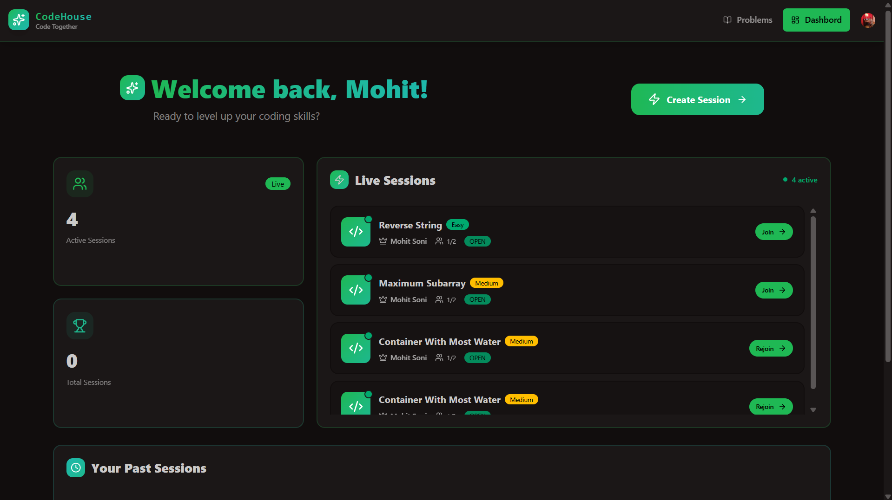

<div align="center">

# 🏠 CodeHouse

### Real-time technical interviews, all in one browser tab.

Video. Audio. Chat. A live code editor with instant grading. No downloads, no setup, no juggling five different tools.


</div>



## About The Project

CodeHouse is a full-stack coding interview platform built for 1-on-1 technical interviews. An interviewer creates a session around a coding problem; a candidate joins from a link. From there, both sides share a live video and audio call, a chat channel, and a synchronized code editor — with an integrated runner that executes the candidate's code and checks it against the expected output in real time.

It's a MERN-style stack (React + Express + MongoDB) glued together with three real-time/infrastructure platforms — **Clerk** for authentication, **GetStream** for video and chat, and **Inngest** for event-driven data syncing — so the app stays fast and simple to build on while still handling the hard parts of real-time communication.

## How It Works

**As an interviewer:**
1. Sign in and pick a problem from the library
2. Create a session — CodeHouse instantly provisions a live video call and chat channel behind the scenes
3. Share the session, watch your candidate work through the problem in real time, and talk it through over video and chat
4. Wrap up and end the session when the interview is done

**As a candidate:**
1. Sign in and join an open session
2. Talk through the approach live with your interviewer over video and audio
3. Write your solution in the built-in editor and run it — get instant feedback on whether your output matches what's expected

## ✨ Key Features

**🎥 Live Video & Audio** — Real-time calls between interviewer and candidate, powered by GetStream's video infrastructure. The call is created automatically the moment a session starts, with no manual setup.

**💬 In-App Messaging** — A dedicated chat channel runs alongside every session, so both sides can share notes, links, or quick messages without leaving the app.

**👨‍💻 Live Code Editor** — A Monaco-powered editor (the same engine behind VS Code) with syntax highlighting for JavaScript, Python, and Java, and starter code for every problem.

**⚡ Instant Code Execution & Grading** — Code runs through a sandboxed execution engine and is automatically checked against the expected output, with instant pass/fail feedback — and a confetti celebration on a pass.

**🔐 Secure, Synced Authentication** — Clerk handles sign-up and sign-in; an event-driven sync via Inngest keeps user records consistent across the app's database and its real-time messaging/video provider automatically.

**📊 Session Dashboard** — Track active sessions, revisit past interviews, and see stats at a glance.

**📚 Problem Library** — A curated set of coding problems, each with a clear description, examples, constraints, and multi-language starter code.

## 🏗️ Architecture Highlights

- **Event-driven user sync** — rather than manually wiring up user creation across three systems, CodeHouse listens for Clerk's webhook events via Inngest and fans them out to MongoDB and GetStream automatically, keeping everything consistent with zero manual glue code.
- **Sandboxed code execution** — candidate code never runs on the app's own server. It's dispatched to a dedicated execution engine that runs it in an isolated sandbox and streams back the result.
- **Real-time infrastructure, not reinvented** — video calls and chat are delegated to GetStream rather than built from scratch, so the app can focus on the interview experience instead of WebRTC plumbing.
- **Monorepo, single deploy** — frontend and backend live in one repository and ship as a single Express service in production, serving the built React app directly.

## Tech Stack

| Layer | Technology |
|---|---|
| Frontend | React 19, Vite, React Router, Tanstack Query, Tailwind CSS v4, DaisyUI |
| Code Editor | Monaco Editor |
| Backend | Node.js, Express 5 |
| Database | MongoDB + Mongoose |
| Authentication | Clerk |
| Real-time Video & Chat | GetStream |
| Event Syncing | Inngest |
| Code Execution | Piston |
| Deployment | Render |

## Getting Started

**Prerequisites:** Node.js, npm, a MongoDB connection, and accounts for [Clerk](https://clerk.com/), [GetStream](https://getstream.io/), and [Inngest](https://www.inngest.com/)

```bash
git clone https://github.com/mohit718/CodeHouse.git
cd CodeHouse
npm install --prefix backend
npm install --prefix frontend
```

Add your keys to `backend/.env` (`DB_URL`, `CLERK_SECRET_KEY`, `STREAM_API_KEY`, `STREAM_API_SECRET`, `STREAM_APP_ID`, `INNGEST_EVENT_KEY`, `INNGEST_SIGNIN_KEY`) and `frontend/.env` (`VITE_CLERK_PUBLISHABLE_KEY`, `VITE_API_BASE_URL`, `VITE_PISTON_API_BASE_URL`), then:

```bash
cd backend && npm run seed && cd ..
npm run dev
```

The app runs at [http://localhost:5173](http://localhost:5173).

## 🚀 What's Next

- Multiple problems / a problem queue per session
- Richer, multi-case grading with hidden test cases
- Session recording and playback for later review
- An admin view for managing the problem library

## Author

Built by **Mohit Soni**

[GitHub](https://github.com/mohit718) &nbsp;•&nbsp; [LinkedIn](https://www.linkedin.com/in/mohitsoni98/)